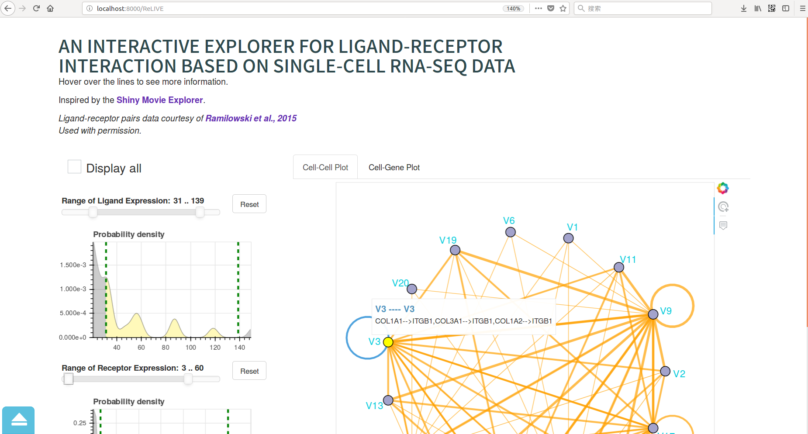
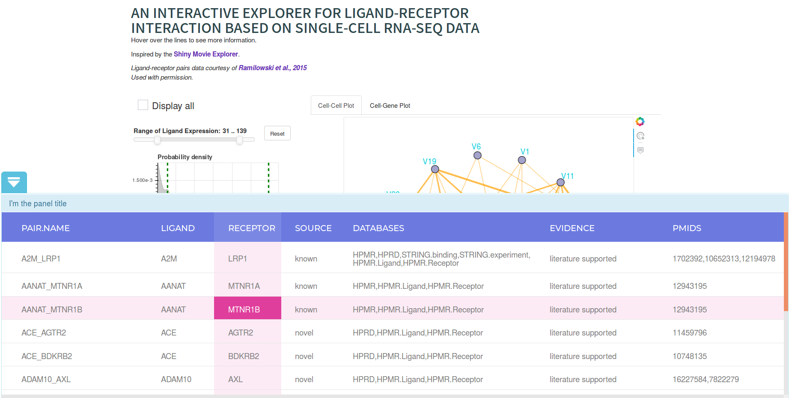

# ReLIVE - Receptors-Ligands Interaction Visualization Explorer  
  
This is a tool for visualizing interactions between ligands and receptors, initially designed for single-cell RNA-Seq data.  
  
Currently two two plot panels are available, the *Cell-Cell plot* and *Cell-Gene Plot*  

  
   
  
  
I'm considering running a website to provide a online service for this, but for better performance, please download this repository and run it on your own device.  
  
To do this, simply run:  
`git clone https://github.com/wu-2018/ReLIVE.git`  
then
`bash ReLIVE/run.sh`  
now, open `localhost:8000` in your browser! 

## Prerequisite  
* Python3 
* Python3 Libraries: bokeh, flask, pandas, scipy
* nginx
 
